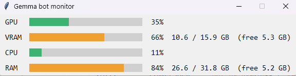

# 终端指令

给 developer 看的：PC 上常用的 PowerShell 指令，直接复制用。都在 bot 文件夹里执行：`C:\Bionic Workspace\001_Testing\CC_DISCORD_BOT`
- 有新的常用指令就加进对应的分类。

<br>

## ▶️ 启动和关闭 bot

### 启动

```
Start-Process .venv\Scripts\python.exe bot.py -WindowStyle Hidden -RedirectStandardError bot-error.log
```

- 在后台跑，监控小窗口会自己弹出来
- 只能开一个，启动前先关掉旧的

<br>

### 关闭

```
Stop-Process -Name python
```

- 一起关掉 bot、监控窗口，以及 bot 自己开的 ComfyUI

<br>

### 看有没有在跑

```
Get-Process python
```

| 看到几个进程 | 意思 |
|---|---|
| 0 | 没在跑 |
| 4 | 1 个 bot（正常：bot + 监控窗口，各两个） |
| 8 | 开了两个 bot，全部关掉再开一个 |
| 4 个以上，但不是 8 个 | ComfyUI 也在跑 |

- 为什么是 4 个：真正在跑的程序只有 2 个（`bot.py` 和监控窗口 `monitor.py`），Windows 的 venv 会给每个程序多开一个启动器，所以 2 × 2 = 4
- `core.py`、`imagegen.py`、`search.py` 在 bot 里面跑，`comfy_node.py` 在 ComfyUI 里面跑，都不算单独的进程

<br>

### 看每个 python 进程在跑哪个文件

```
Get-CimInstance Win32_Process -Filter "name='python.exe'" | Select-Object ProcessId, ParentProcessId, CommandLine
```

- 正常：`bot.py` 两行、`monitor.py` 两行
- 路径太长被截成 `...` 时，在指令最后加 ` | Format-List` 就能看到完整的
- 后两行的 ParentProcessId 是 `bot.py` 的进程号 = 监控窗口是 bot 开的（10-09 实测确认）

10-09 实测结果（一个 bot 正常在跑）：

| 进程号 | 由谁开的 | 是什么 |
|---|---|---|
| 28772 | PowerShell | `bot.py` 的启动器（`.venv`） |
| 10812 | 28772 | `bot.py` 本体 |
| 11636 | 10812（bot） | 监控窗口的启动器 |
| 37164 | 11636 | 监控窗口本体（`monitor.py`） |

<br>

### 监控窗口



- 就是上面后两个进程（启动器 + `monitor.py` 本体）
- 显示显卡、显存、CPU、内存的占用，和 `/status` 一样
- 关掉它不影响 bot
- 不想每次弹出来：`.env` 加一行 `MONITOR_WINDOW=off`，重启 bot
- 看到 `bot.py` 四行 = 开了两个 bot

<br>

## 📜 看 log

重启会覆盖 `bot-error.log`，**重启之前**先看。

### 改图、refine、换颜色、换角色

```
Select-String -Path bot-error.log -Pattern "Edit:|Refine:|Recolor|Swap:|SD_CONTROLNET" | Select-Object -Last 5
```

<br>

### bot 说 "offline" 或出错

```
Select-String -Path bot-error.log -Pattern "lms|reload|LM Studio|ERROR|WARNING" | Select-Object -Last 10
```

<br>

### 最后 20 行

```
Get-Content bot-error.log -Tail 20
```

<br>

## 🔀 Git

### 看现在跑的是哪个版本

```
git log --oneline -1
```

- 跟 Claude 给的 commit id 对一下，对得上才开始测

<br>

### 测试分支（更新到 Claude 刚推的版本）

```
Stop-Process -Name python
git fetch
git checkout claude/task-nb5ft9
git pull
Start-Process .venv\Scripts\python.exe bot.py -WindowStyle Hidden -RedirectStandardError bot-error.log
git log --oneline -1
```

<br>

### 一键：合并到 main 并重启（最常用）

```
Stop-Process -Name python
git checkout main
git pull
git merge origin/claude/task-nb5ft9
git push
Start-Process .venv\Scripts\python.exe bot.py -WindowStyle Hidden -RedirectStandardError bot-error.log
git log --oneline -1
```

- 分支名换成 Claude 报告里给的那个
- 最后一行要跟报告里的 commit id 一样

<br>

### 合并分支到 main

```
git checkout main
git pull
git merge origin/claude/task-nb5ft9
git push
git log --oneline -1
```

- 一定要写 `origin/`，不然合的是电脑上的旧分支，会显示 "Already up to date"
- 看到 "Fast-forward" 和文件列表 = 合并成功

<br>

### 回到 main 跑正式版

```
Stop-Process -Name python
git checkout main
git pull
Start-Process .venv\Scripts\python.exe bot.py -WindowStyle Hidden -RedirectStandardError bot-error.log
```

<br>

### 其他常用

| 想做什么 | 指令 |
|---|---|
| 看现在在哪个分支、有没有改过的文件 | `git status` |
| 看最近 10 个提交 | `git log --oneline -10` |
| 看 main 还缺分支的哪些提交 | `git log --oneline main..origin/claude/task-nb5ft9` |
| 自己改了文件后提交 | `git add 文件名`，再 `git commit -m "说明"` |
| 推上 GitHub | `git push` |
| 放弃自己没提交的改动（小心，改动会消失） | `git restore 文件名` |

- `.env` 永远不要 `git add`（里面有 token，本来就设成不上传）

<br>

## 🐍 Python 环境

| 想做什么 | 指令 |
|---|---|
| 进入 venv | `.venv\Scripts\activate` |
| venv 被挡住时先执行 | `Set-ExecutionPolicy -Scope Process -ExecutionPolicy Bypass` |
| 装或更新套件 | `pip install -r requirements.txt` |
| 跑单元测试 | `pip install -r requirements-dev.txt`，再 `python -m pytest` |

<br>

## 🎨 ComfyUI 和 LM Studio

| 想做什么 | 做法 |
|---|---|
| 手动开 ComfyUI | 到 ComfyUI 文件夹双击 `run_nvidia_gpu.bat` |
| `comfy_node.py` 改过之后 | ComfyUI 要重启一次（`Stop-Process -Name python` 会一起关掉 bot 开的 ComfyUI，再启动 bot 即可） |
| 开 LM Studio 服务器 | `lms server start` |
| 看 LM Studio 载入了哪些模型 | `lms ps` |

<br>

## 🔧 改 `.env` 之后

- `.env` 只在启动时读，改完要重启 bot（先关闭，再启动）
